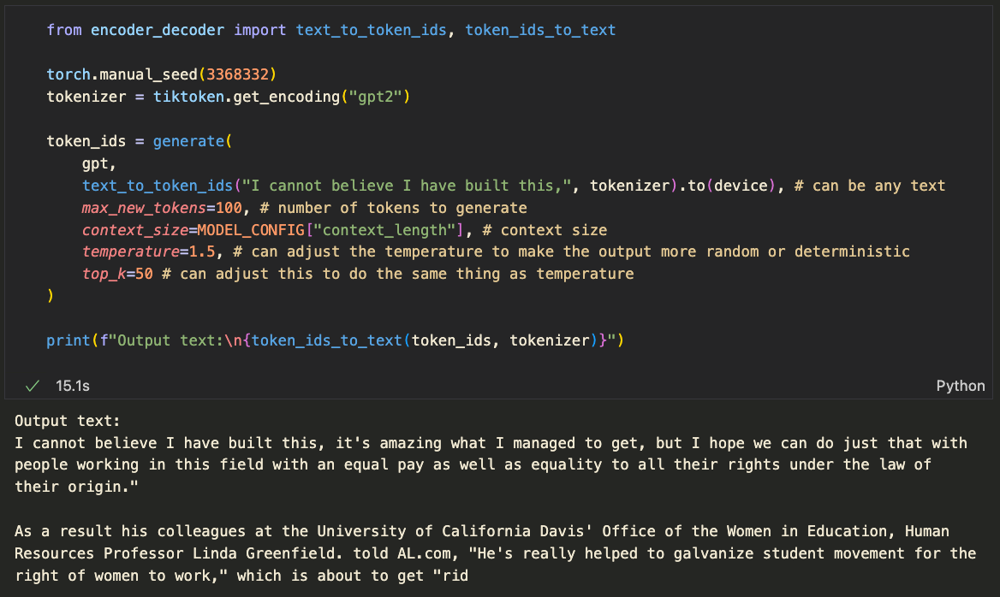
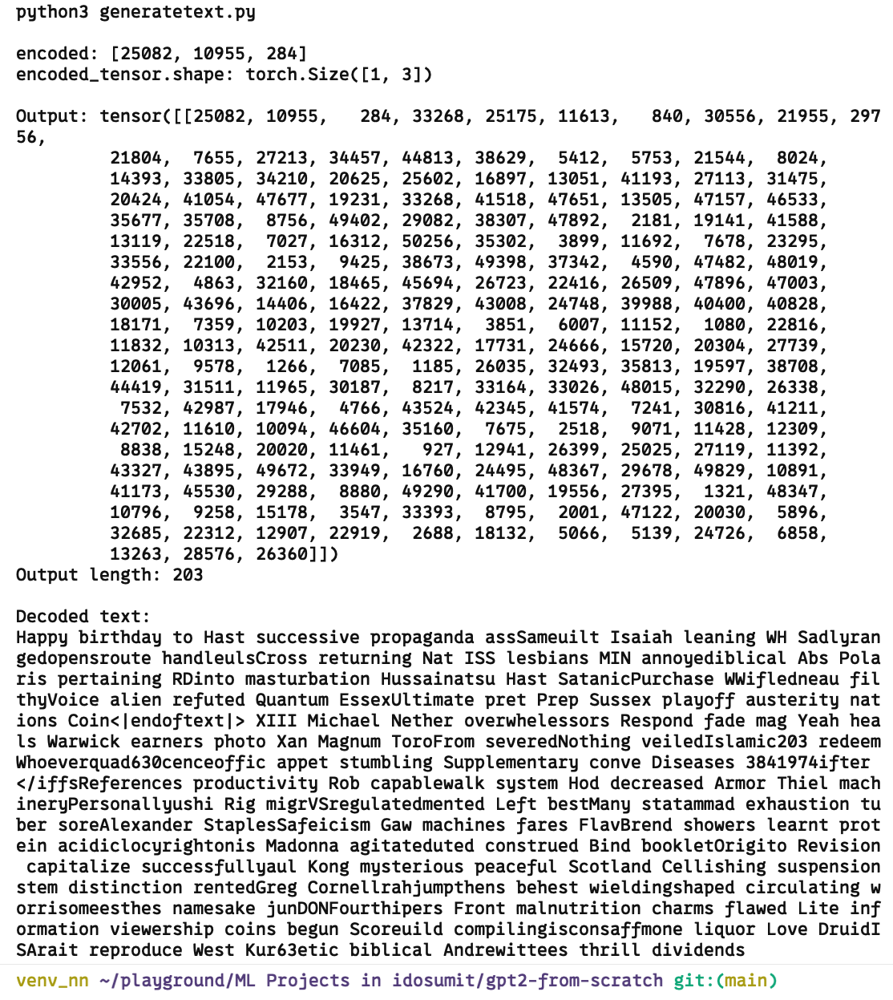

# GPT-2 From Scratch

Table of contents:

- [INTRODUCTION](#introduction)
- [SETUP AND INSTALLATION](#setup-and-installation)
- [RUNNING THE CODE](#running-the-code)
- [COMPLETED UPDATES](#completed-updates)
- [TODO](#todo)
- [REFERENCES](#references)

---

## INTRODUCTION

I've always wanted to create a GPT-2 model from scratch, and this is my attempt at it. What I have in this repository is a fully-working GPT-2 model that can generate texts based on a given input and expected length of the text completion.

> [!IMPORTANT]
> **Update of Dec 15, 2024:**\
> Created and tested the code that pretrains the model. It works. However, there are some caveats:
> I tried training the model on a very small dataset using [the-verdict.txt](./the-verdict.txt) file, which barely has 18,000 total characters. You can probably infer that these weights are not very good. However, training the model on a larger dataset and a larger compute is definitely recommended if you can, but I am extremely GPU-poor, and the free GPU resources I tried (Kaggle in particular) are limited. You can take a look at the notebook I published on Kaggle [here](https://www.kaggle.com/code/sumitpokharel/gpt2-from-scratch) by making use of the tiny-textbooks dataset from [huggingface](https://huggingface.co/datasets/nampdn-ai/tiny-textbooks).

There is also another way to load pretrained weights from OpenAI's GPT-2 model. I have loaded my model with the GPT-2 weights and it works very well. You can take a look at the [my-model-w-oai-weights.ipynb](./my-model-w-oai-weights.ipynb) file to see how I did it.

This is how it looks:\


## SETUP AND INSTALLATION

#### To start, use the terminal to go to the directory where you want to clone the repository and clone it:

```bash
git clone https://github.com/idosumit/GPT2-from-scratch.git

```

#### Navigate inside the repository:
```bash
cd GPT2-from-scratch
```

#### Create a virtual environment:

```bash
python -m venv venv_gpt2
```

#### Activate the virtual environment:
```bash
source venv_gpt2/bin/activate
```

#### Finally, install all the dependencies:
```bash
pip install -r requirements.txt
```

Note: `pip` should automatically be installed if you create a virtual environment, but in case your terminal throws errors, you can install it manually too: 

[pip installation](https://pip.pypa.io/en/stable/installation/)

And that's it! We have set up the enviroment.

## RUNNING THE CODE

### A. With OpenAI Weights

Please go to [my-model-w-oai-weights.ipynb](./my-model-w-oai-weights.ipynb) to see how to load the pretrained weights from OpenAI's GPT-2 model and generate text.

### B. With Your Own Weights

For this, you will firstly need to train the model using your custom dataset. You can do this by configuring your dataset and training parameters in the [train.py](./train.py) file. There are lots of datasets available on the internet that you can use for this, but pretty much all require GPUs to pretrain the model to a half-decent level. And I am extremely GPU-poor, so I could only do it on Kaggle (see the [Kaggle notebook](https://www.kaggle.com/code/sumitpokharel/gpt2-from-scratch) I published).

Once you train the model, you can load the weights into the model (see [my-model-w-oai-weights.ipynb](./my-model-w-oai-weights.ipynb) as well as the end of [train.py](./train.py) for how to do this) and then go to [generatetext.py](./generatetext.py) to generate text.

You can change the input text as well as the desired length of the output text in the [generatetext.py](./generatetext.py) file (lines 20 and 200 respectively). Based on the input text, the model will generate a completion of the text of the desired length.

To run the code, you can use the following command:

```python
python generatetext.py
```

This will generate a text completion based on the input text and the desired length of the output text. The output will be printed to the console.

It looks something like the following at the moment (based on `start_context`="Happy birthday to" and `max_new_tokens`=200):



---

## COMPLETED UPDATES

- [x] Multi-head attention
- [x] Feed-forward network
- [x] Gelu activation function
- [x] Layer normalization
- [x] Transformer block
- [x] GPT-2 model (124M)
- [x] Text generation (simple gibberish)
- [x] Pretraining
  - [x] Cross-entropy loss
  - [x] Backpropagation
  - [x] Update weights

---

## TODO

(+) = in progress

- [ ] Fine-tuning (+)
  - [ ] for classification (+)
  - [ ] for following instructions (+)

---

## REFERENCES

This has been made possible largely due to the book "[Build a Large Language Model from Scratch](https://www.manning.com/books/build-a-large-language-model-from-scratch)" by Sebastian Raschka. God bless the man.

Additional resources that I referred to:
- [Language Models are Unsupervised Multitask Learners](https://cdn.openai.com/better-language-models/language_models_are_unsupervised_multitask_learners.pdf), the original GPT-2 paper
- [Let's build a GPT: from scratch, in code, spelled out](https://www.youtube.com/watch?v=kCc8FmEb1nY&t=9s) by Andrej Karpathy
- [Attention is all you need](https://arxiv.org/abs/1706.03762), the original Transformer paper
- [Understanding LLMs: A Comprehensive Overview from Training to Inference](https://arxiv.org/abs/2401.02038)
- [The Transformer Family](https://lilianweng.github.io/posts/2023-01-27-the-transformer-family-v2/) by Lilian Weng
